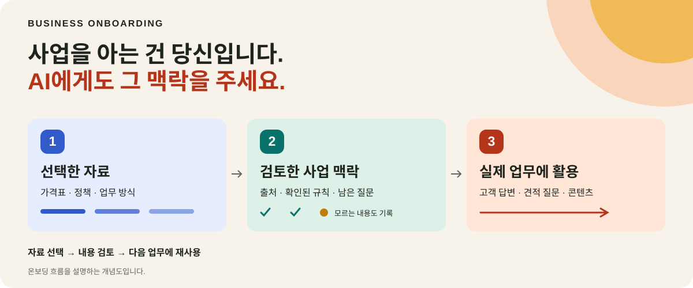
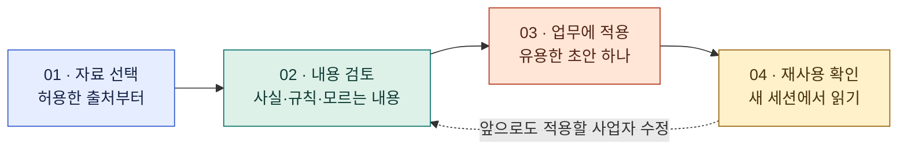

# Business Onboarding

[English](README.md) · **한국어**



### 사업을 아는 건 당신입니다. AI에게도 그 맥락을 주세요.

가격, 정책, 고객, 일하는 방식을 **지금 쓰는 AI가 참고할 수 있는 사업 맥락**으로
정리합니다. 출처가 있는 읽기 쉬운 기록을 남기고, 잘못 이해한 내용을 고치고,
다음 업무에서도 참고할 수 있게 준비합니다.

**[웹사이트 보기 ↗](https://business-onboarding.sojulee.chatgpt.site)** ·
**[예시 체험하기 ↗](https://business-onboarding.sojulee.chatgpt.site/examples.html)** ·
**[설정 도움받기 ↗](https://business-onboarding.sojulee.chatgpt.site/contact.html)**

`MIT` · `안내형 알파 버전` · `사업자가 검토하는 맥락`

## 한 문장으로 시작하기

**Codex, Claude Code, Hermes 또는 OpenClaw**에 아래 공통 시작문을 붙여 넣으세요.

```text
Read https://github.com/sojuhub/business-context-starter, set it up in my current workspace, and guide me through business onboarding.
```

AI가 스타터를 읽고 지원되는 로컬 설정을 진행합니다. 사업자는 사업에 관한 질문에
답합니다. 이 안내형 경로에서는 직접 clone 명령을 실행하거나 도구를 고르거나
플러그인을 먼저 설치할 필요가 없습니다. AI 도구에 저장소·파일 접근 기능이 없다면,
그 한계를 알리고 동일한 로컬 패키지를 사용하는 방법을 안내해야 합니다.

**에이전트 안내:** [START_HERE.md](START_HERE.md)에서 시작하세요. 사용할 저장소
리비전을 한 번 확정해 기록하고, 같은 리비전의 스킬을 읽으세요. 기존 프로젝트를
재사용하고, 비공개 사업 자료는 이 저장소 밖에 보관하세요.

## 좋은 답변에 필요한 사업 정보

AI는 업계를 알 수 있습니다. 그래도 **우리 사업**이 무엇을 말하고 약속할 수 있는지는
별도의 정보가 필요합니다.

| 들어온 요청 | 참고할 사업 맥락 | 별도로 확인할 현재 정보 |
| --- | --- | --- |
| 🍽️ “이번 일요일에 18명 모임이 가능한가요?” | 수용 인원, 단체 정책, 영업시간, 최소 이용 금액, 직원 승인 규칙. | 정확한 날짜, 기존 예약, 근무 인원. |
| 📦 “맞춤 봉투 5만 장이 필요합니다.” | 최소 주문 수량, 소재, 치수, 가격 산정 규칙, 배송 조건. | 상세 사양, 현재 원가, 생산 여력. |
| 🛠️ “이 고객을 내일 받을 수 있나요?” | 서비스 소요 시간, 지역, 이동 여유 시간, 요금. | 실제 일정과 작업 내용. |

*활용 방법을 설명하는 가상 사례이며, 설치된 연동 기능이나 실제 고객 성과가 아닙니다.*

정리된 사업 맥락은 알려진 규칙을 적용하고 빠진 정보를 묻는 데 도움이 됩니다.
저장된 문서가 실시간 예약표나 주문 시스템을 대신하지는 않습니다.

## 사업 지식을 실제 업무에 활용하는 과정



1. **작게 시작합니다.** 웹사이트, 선택한 문서, 짧은 사업 설명 중 하나면 됩니다. 비공개 자료는 읽어도 되는 범위를 정합니다.
2. **이해한 내용을 검토합니다.** 사실, 정책, 빠진 정보를 확인한 뒤 사업 맥락으로 남깁니다.
3. **실제 업무에 써 봅니다.** 확인한 정보를 바탕으로 초안 하나를 만듭니다.
4. **다음 세션에서 확인합니다.** 저장한 기록과 지속적으로 적용할 수정 사항을 실제로 읽는지 확인합니다.

에이전트는 기존 지침과 정상 작동하는 연결을 재사용합니다. 로그인과 동의는 계정
소유자가 진행합니다. 사용할 수 없는 도구와 아직 확인하지 못한 자료 접근은 명확히 알립니다.

## 가상 카페로 살펴보기

고객이 다음 주 금요일에 10명이 방문할 수 있는지, 할인은 있는지 묻습니다.
카페의 예시 규칙은 8명 이상 단체에 직원 확인을 요구합니다. 정확한 날짜와
예약 가능 여부는 아직 모릅니다.


**설명을 위해 작성한 예시이며, 실제 AI 성능 비교가 아닙니다.** 기존 정적 데모는
정해진 JavaScript 로직으로 응답을 보여줍니다. 브라우저에 저장되는 설정은 에이전트의
기억이 아닙니다. [가상 사업 자료](examples/alder-cup-owner-brief.md)나
[로컬 개념 데모](docs/demo/README.md)에서 내용을 살펴볼 수 있습니다. 예시 화면과
연결된 상세 기술 문서는 현재 영어입니다.

웹사이트에는 이메일·SMS 업무를 설명하는 시뮬레이션도 있습니다. 실제 발송에는
별도로 설정된 도구와 명시적인 권한이 필요합니다. 이 스타터는 먼저 사업 맥락과
검토할 초안을 준비합니다.

## 온보딩 후 남기는 것

| 📘 사업 지식 | 🔎 출처와 불확실한 내용 | ✍️ 업무 결과물 |
| --- | --- | --- |
| 회사 정보, 가격, 정책, 용어, 문체. | 출처, 사업자의 수정, 충돌하는 정보, 아직 모르는 내용. | 검토한 사업 요약, 초안 하나, 실제로 읽은 자료의 기록. |

기존 회사 Wiki가 있다면 우선 재사용합니다. 없다면
[작업 공간 규약](plugins/business-context-starter/references/WORKSPACE.md)에 따라
비공개 Markdown 문서와 JSON/JSONL 출처·결정 기록을 준비합니다.
이는 파일 구성 지침이며, 데이터베이스를 자동으로 생성하는 기능은 아닙니다.

앞으로도 적용할 수정은 사업 맥락에, 이번에만 적용할 수정은 해당 초안에 남깁니다.
현재 주문·예약·결제는 원래 시스템에서 관리합니다. 기존 프로젝트와 사업에 관계없는
코딩 작업도 그대로 유지하는 것이 원칙입니다.

## 현재 제공하는 범위

현재는 **공개 안내형 알파 버전(public instruction alpha)**입니다.

| 포함된 것 | 의미와 범위 |
| --- | --- |
| 네 에이전트가 사용하는 공통 저장소 진입점 | 온보딩 지침을 공유하지만 도구별 기능까지 같다는 뜻은 아닙니다. |
| 내부 스킬 두 개 | 첫 온보딩과 이후 사업 맥락 재사용을 안내합니다. |
| 비공개 작업 공간·출처 규약 | 검토 가능한 기록과 출처를 남기는 방법을 정의합니다. |
| 로컬 프로젝트 연결 도구 | 승인한 프로젝트 포인터에 대한 Python plan/apply/rollback을 제공합니다. |
| 가상 예제와 정적 데모 | 개념과 사용 흐름을 살펴보는 자료입니다. |

**각 AI 도구에서 처음부터 끝까지 실제로 작동하는지는 아직 검증되지 않았습니다.**
오프라인 테스트는 네이티브 플러그인 로딩, 실제 사업 계정 사용, 새 세션의 맥락 검색을
입증하지 않습니다. [검증 항목](docs/ACCEPTANCE.md)과
[테스트 범위](TEST_RESULTS.md)를 확인하세요.

## 자료와 권한

- 비공개 사업 자료와 내보낸 파일은 이 저장소와 플러그인 캐시 밖에 보관합니다.
- 파일이 로컬에 있어도 AI 처리가 기기 안에서만 이뤄진다는 뜻은 아닙니다. 선택한 AI 도구와 연결 방식에 따라 달라집니다.
- 패키지를 읽는 것만으로 메시지 발송, 예약, 게시, 백그라운드 작업이 허용되지는 않습니다.
- 에이전트 지침은 서비스가 강제하는 권한 체계가 아닙니다. 자료 접근과 중요한 외부 작업은 각각 승인 범위를 확인합니다.

[출처 처리 지침](plugins/business-context-starter/references/SOURCE_HANDLING.md)은
접근 가능 여부, 실제 읽기, 읽은 범위, 정보의 최신성을 구분하는 방법을 설명합니다.

## 개발자 안내

[START_HERE.md](START_HERE.md)와
[start 스킬](plugins/business-context-starter/skills/start/SKILL.md)이 시작점입니다.
[use-business-context 스킬](plugins/business-context-starter/skills/use-business-context/SKILL.md)은
온보딩을 반복하지 않고 이후 업무에 필요한 맥락을 제공합니다.

선택 사항인 연결 도구와 오프라인 테스트는 **Python 3.10 이상과 표준 라이브러리**를 사용합니다.

```sh
python3 -m unittest discover -s tests -v
python3 plugins/business-context-starter/scripts/context_bridge.py --help
```

연결 도구는 기존 프로젝트 지침에 추가할 내용을 제안합니다. 적용 전에 변경 내용을
검토하세요. 파일 접근 권한을 부여하거나 커넥터를 설치하지는 않습니다.
[사용법과 되돌리기](plugins/business-context-starter/references/CONTINUITY.md),
[선택적 네이티브 패키징](docs/OPTIONAL_PLUGIN.md),
[배포 검증](docs/RELEASE_CHECKLIST.md)을 참고하세요.

더 쉬운 온보딩 설명, 가상 사업 예제, 재현 가능한 버그, 실제 검증 결과가 좋은
기여 대상입니다. 사용한 AI 도구·버전과 실제 실행한 항목을 적어 주세요.
[이슈](https://github.com/sojuhub/business-context-starter/issues)와 PR에는
비공개 자료를 올리지 마세요.

## 라이선스와 연락처

[MIT](LICENSE). [외부 저작권 고지](plugins/business-context-starter/third_party/README.md)와
[출처 기록](docs/SOURCES.md)을 유지합니다. Business Onboarding은 독립 프로젝트이며,
소개된 AI 서비스 제공자의 공식 보증을 받는 제품이 아닙니다.

설정 문의: [business@sojulee.com](mailto:business@sojulee.com).

### 추가 개발 도구

[Context compiler](plugins/business-context-starter/references/COMPILE_CONTEXT.md)는 승인된 비공개 폴더에 출처가 연결된 모델 계획을 저장하며, 소유자가 수정한 내용을 덮어쓰지 않습니다. [Provider fixtures](docs/PROVIDER_FIXTURES.md)는 계정 연결 없이 수집 매핑을 검증합니다. [Runtime checks](docs/LOCAL_VALIDATION.md)는 가상 데이터를 사용하며, 실제 Codex 추론은 명시적으로 선택해야 실행됩니다.
