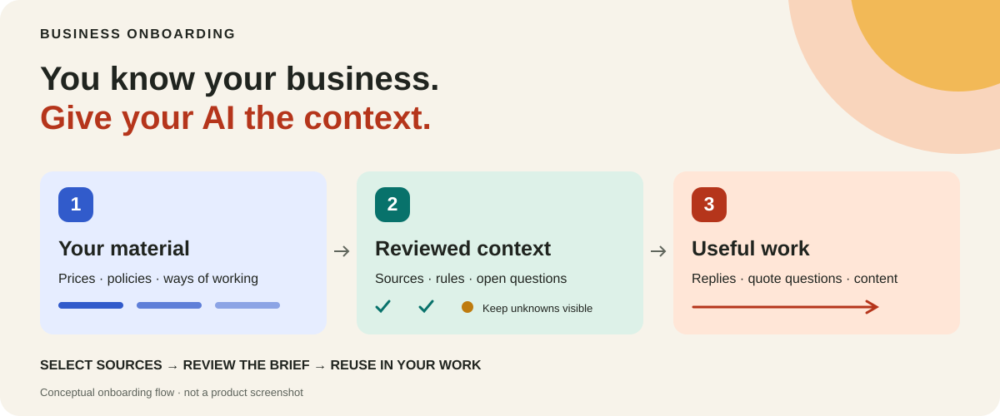
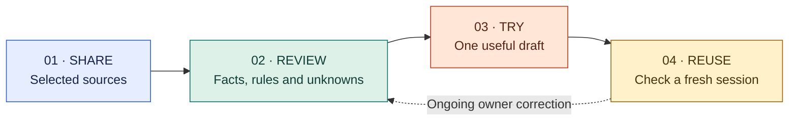
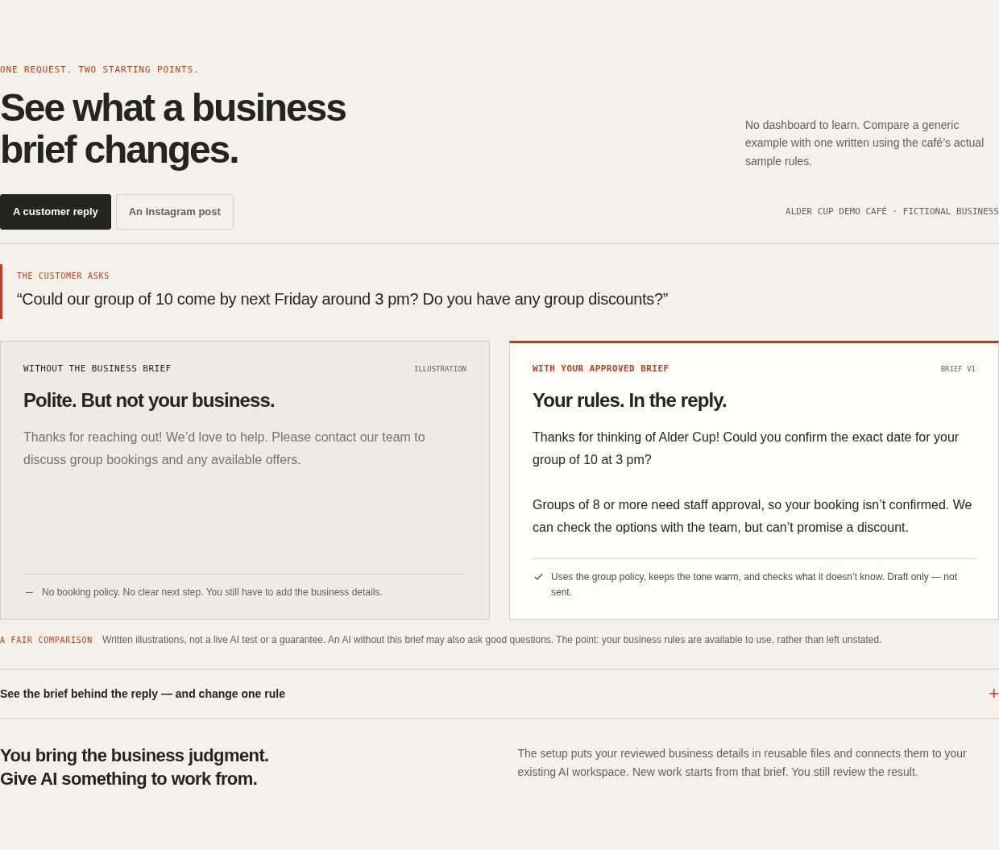

# Business Onboarding

**English** · [한국어](README.ko.md)



### You know your business. Give your AI the details it needs to help.

Turn your prices, policies, customers and ways of working into **reviewed business
context for the AI you already use**. Keep readable notes with their sources,
correct what is wrong, and make them available to later work.

**[Explore the website ↗](https://business-onboarding.sojulee.chatgpt.site)** ·
**[Try the examples ↗](https://business-onboarding.sojulee.chatgpt.site/examples.html)** ·
**[Get setup help ↗](https://business-onboarding.sojulee.chatgpt.site/contact.html)**

`MIT` · `Instruction alpha` · `Owner-reviewed context`

## Start with one message

Copy this into **Codex, Claude Code, Hermes or OpenClaw**:

```text
Read https://github.com/sojuhub/business-context-starter, set it up in my current workspace, and guide me through business onboarding.
```

Your AI reads the starter and handles the supported local setup. You answer the
business questions. No manual clone command, tool selection or plugin installation
is required for this instruction-based route. If the host lacks repository or
filesystem access, it must explain the limitation and offer the same local package.

**For agents:** begin with [START_HERE.md](START_HERE.md). Resolve and record one
repository revision; read the linked skill from that same revision. Reuse the
existing project. Keep private business records outside this repository.

## The missing part of a good answer

AI may know your industry. It still needs the details that decide what **your
business** can say or do.

| A request | The business context behind it | What still needs checking |
| --- | --- | --- |
| 🍽️ “Can we host 18 people this Sunday?” | Capacity, group policy, hours, minimum spend and staff approval. | The exact date, reservations and staffing. |
| 📦 “We need 50,000 custom bags.” | MOQ, materials, dimensions, pricing rules and shipping terms. | Specifications, current costs and production capacity. |
| 🛠️ “Can you fit this customer in tomorrow?” | Service duration, locations, travel buffers and pricing. | The actual schedule and job requirements. |

*Illustrative scenarios, not installed integrations or customer results.*

A useful brief helps the agent apply known rules and ask about what is missing.
It does not turn a saved document into a live booking calendar or order system.

## From business knowledge to useful work



1. **Start small.** A website, selected document or short explanation is enough. Choose any private material the agent may read.
2. **Review the understanding.** Check the facts, policies and gaps before they become business context.
3. **Try a real task.** Prepare a draft using the approved information.
4. **Verify reuse.** Check that a new session actually reads the saved notes and an ongoing correction.

The agent reuses your instructions and working connections. Login and consent stay
with the account holder. Unavailable tools and unverified reads must remain visible.

## See the idea in a fictional cafe

A customer asks about a group of ten, next Friday, and a discount. The cafe's
sample rules require staff confirmation for groups of eight or more. The exact
date and availability are unknown.



**Authored illustration—not a measured AI comparison.** The existing static demo
uses deterministic responses. Its browser preferences are not agent memory.
Read the [sample business brief](examples/alder-cup-owner-brief.md) or explore the
[local concept demo](docs/demo/README.md).

The website also illustrates email and SMS workflows. Actual sending needs
separately configured tools and explicit permission; the starter first prepares
business context and a reviewed draft.

## What you keep

| 📘 Business knowledge | 🔎 Evidence and uncertainty | ✍️ Useful work |
| --- | --- | --- |
| Company facts, prices, policies, terminology and tone. | Sources, owner corrections, conflicts and missing information. | A reviewed brief, one draft and a record of what was actually read. |

Reuse an existing company wiki where possible. Otherwise, the
[workspace contract](plugins/business-context-starter/references/WORKSPACE.md)
describes private Markdown notes with JSON/JSONL source and decision records.
These are file conventions, not an automatically provisioned database.

An ongoing correction belongs in the business context; a one-off edit belongs to
the draft. Live orders, bookings and payments remain in their original systems.
Your existing project and unrelated coding workflow should stay intact.

## What is available today

This is a **public instruction alpha**.

| Included | What that means |
| --- | --- |
| One repository-read entry for four agents | Shared onboarding instructions, not identical host capabilities. |
| Two internal skills | Initial onboarding and later business-context reuse. |
| Private workspace and source contracts | Guidance for reviewable notes and provenance. |
| Local project-link helper | Python plan/apply/rollback for an approved project pointer. |
| Synthetic examples and static demos | Ways to understand and inspect the idea. |

**End-to-end host behavior remains unverified.** Native plugin loading, live-account
behavior and fresh-session retrieval are not established by offline tests.
See [acceptance checks](docs/ACCEPTANCE.md) and [test scope](TEST_RESULTS.md).

## Your information and permissions

- Keep private business records and exports outside this repository and plugin caches.
- Local files do not guarantee local-only AI processing; the chosen host and tools determine that path.
- Reading this package does not authorize sending messages, booking, publishing or background jobs.
- Instructions are not provider-enforced permissions. Review source access and consequential actions separately.

The [source-handling guide](plugins/business-context-starter/references/SOURCE_HANDLING.md)
explains how the agent should distinguish access, actual reading, scope and freshness.

## For developers

The entry is [START_HERE.md](START_HERE.md) and the
[start skill](plugins/business-context-starter/skills/start/SKILL.md).
The [use-business-context skill](plugins/business-context-starter/skills/use-business-context/SKILL.md)
supplies context for later work without repeating onboarding.

The optional bridge and offline checks use **Python 3.10+ and the standard library**:

```sh
python3 -m unittest discover -s tests -v
python3 plugins/business-context-starter/scripts/context_bridge.py --help
```

The optional [context compiler](plugins/business-context-starter/references/COMPILE_CONTEXT.md)
materializes a source-linked model plan in an approved private directory and
refuses to overwrite owner edits. [Provider fixtures](docs/PROVIDER_FIXTURES.md)
exercise collection mappings without accounts. [Runtime checks](docs/LOCAL_VALIDATION.md)
use fictional inputs and explicitly opt in to actual Codex inference.

The bridge proposes additive project-instruction changes. Review its diff before
applying. It does not grant filesystem access or install connectors. See
[bridge usage and rollback](plugins/business-context-starter/references/CONTINUITY.md),
[optional native packaging](docs/OPTIONAL_PLUGIN.md) and
[release verification](docs/RELEASE_CHECKLIST.md).

Useful contributions: clearer onboarding, synthetic business examples, reproducible
bugs and observed acceptance results. Include the host/version and what actually
ran. Keep private records out of [issues](https://github.com/sojuhub/business-context-starter/issues)
and pull requests.

## License and contact

[MIT](LICENSE). [Third-party notices](plugins/business-context-starter/third_party/README.md)
and [source provenance](docs/SOURCES.md) are retained. Business Onboarding is
independent and is not endorsed by the featured AI providers.

Setup questions: [business@sojulee.com](mailto:business@sojulee.com).
